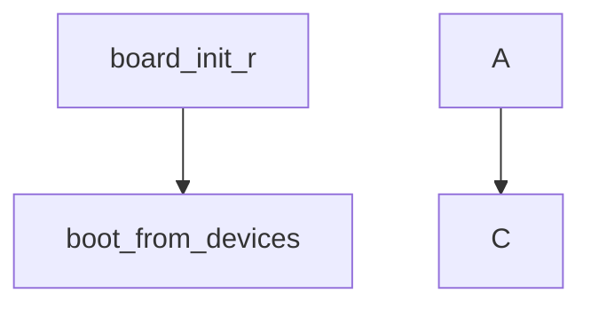

https://redmine.rock-chips.com/projects/fae/issues?page=2

\- ddpai_camera

\- 123456@ddpai.com

# uboot移植

## 1.烧录失败问题


uboot编译参数增加


## 2.环境变量保存配置

## 3.CONFIG_ENV_PARTITION配置的作用

该配置表示分区表在环境变量中，由环境变量blkdevparts确定

kernel启动位置也配置在该环境变量中。

？配置SPL_ENV_PARTITION会导致uboot被恢复，暂时不知道什么原理。

配置CONFIG_ENV_PARTITION后编译不过修改如下

方法一:


方法二:


blkdevparts=mmcblk0:18M(uboot),12M(boot),51200K(rootfs),153600K(appfs),10240K(usrcfg),98304K(reserve),-(storage)

所以kernel启动位置为

18 x 1024 x 1024 = 0x1200000

 0x1200000/512 = 0x9000(36864)

rootfs位置为

18M+12M=30 x 1024 x1024 =0x1E00000

0x1E00000/512 = 0xf000

appfs位置为

18M + 12M + 51200K = 0x1E00000 + 51200 x 1024(0x3200000) = 0x5000000

usrcfg位置为

0x5000000 + 153600x1024 = 0xE600000


## 4.loader uboot启动位置确定

loader位置确定：目前emmc默认0x8000 ，nand是0x20000这个应该是配置不了的，没找到在哪配置

uboot位置:loader加载uboot的地址在uboot的config里配CONFIG_MTD_BLK_U_BOOT_OFFS=512*offset(byte)

# nand移植

## 1.rootfs挂载不上


dts配置有问题，导致读nand异常，文件系统镜像是没问题的，怀疑dts配置电源有问题，导致nand异常了。

## 2.usrcfg挂载不上


是因为在写入ubi文件系统之前擦除nand的空间不够大，擦除的大小要大于等于文件系统的大小加坏块的大小，此时可以把存放整个文件系统的nand空间全部擦除就可以。

擦除方法:

使用烧录工具擦除，先烧录DownloadBin到ddr，然后用高级功能中的全部擦除。


# 外设调试

## 1.tf卡无法识别


驱动没有probe，sdmmc0引用了vcc_sd，vcc_sd引用了vcc3v3_sys，vcc3v3_sys是在这个rk809里面配的，我们的没有用rk809，导致vcc3v3_sys没有被初始化，而导致sdmmc0没有被probe，在等待相关外设初始化。

## 2.不插卡上电无法识别tf卡

系统起来后有地方使用了tf的det引脚，把det gpio改成out了，导致无法检测卡插入。

## 3.更新sdk后uboot无法识别tf卡

```
gpio0_A5 sd_det 0x201a0004 [201a0004: 00000010] 
gpio0_A6 sd_ctr 
gpio2_A4 SD_3V3_CLK
gpio2_A5 SD_3V3_CMD 0x201b8044 201b8044: 00000011
```

引脚复用没有配置，复用不对，之前在spl阶段probe pinctrl了，新sdk spl阶段没有probe mmc，uboot阶段配置中又去掉了CONFIG_OF_U_BOOT_REMOVE_PROPS="pinctrl-0 pinctrl-names 。。。，在uboot阶段去掉pinctrl-0 pinctrl-names 配置驱动复用

# 3.main_app无法挂载tf卡

单存储需要把tf节点配置为mmcblk0，修改dts


# 5.sensor配置

sensor链路配置

i2c(csi_dphy) - >	mipi_csi -> cfi_lvds -> isp

```
cat /proc/rkisp-vir0
cat /proc/rkcif-mipi-lvds
```


# 6.音频配置

mp3转pcm格式命令。 

```
ffmpeg -i Power_On.mp3 -f s16le -acodec pcm_s16le -ar 16000 -ac 2 output.pcm
```

   – `-i input.mp3`：指定输入的mp3文件路径和文件名。

   – `-f s16le`：指定输出格式为s16le（16-bit little-endian）。

   – `-acodec pcm_s16le`：指定输出音频编码为pcm_s16le。

   – `-ar 16000`：采用率。

   – `-ac 2`：通道数。

   – `output.pcm`：指定输出的pcm文件路径和文件名。

播放pcm文件dmeo

```
rk_mpi_ao_test -i /app/sd/cap_out.pcm --sound_card_name=hw:0,0 --device_ch=2 --device_rate=16000 --input_rate=16000 --input_ch=2 --bit=16 --set_volume=100 --loop_count=1
```

录音测试

```
rk_mpi_ai_test --device_rate=16000 --device_ch=2 --out_ch=2 --out_rate=16000 --output=/app/sd/ --bit=16 --sound_card_name=hw:0,0 --set_volume=100
```


echo 160 >/sys/class/gpio/export

echo out >/sys/class/gpio/gpio160/direction 

echo 1 >/sys/class/gpio/gpio160/value 


i2cget -f -y 4 0x62 0x05

i2cset -f -y 4 0x62 0x05 0x27


i2cset -f -y 4 0x18 0x14 0x1a

i2cget -f -y 4 0x18 0x14


i2cset -f -y 4 0x18 0x44 0x00

i2cget -f -y 4 0x18 0x44

时钟查看

cat /sys/kernel/debug/clk/clk_summary |grep sai0

## 测试工具

tinyalsa

[如何查看声卡、pcm设备以及tinyplay、tinymix、tinycap的使用-CSDN博客](https://blog.csdn.net/luyao3038/article/details/121859072)

```
源码下载
git clone https://gitee.com/mirrors_tinyalsa/tinyalsa.git
```

修改Makefile

```
export PREFIX ?= /home/zhoukexi/work/open_source/tinyalsa/install
export CROSS_COMPILE := arm-rockchip1240-linux-gnueabihf-
```


mkdir install

make all;make install

```
tinycap /app/sd/mic.wav -d 0
tinyplay /app/sd/mic.wav
```


## i2s时钟配置

LRCLK = 16K

采样率在ini文件中配置


SCLK(BCLK)=1.024m = 64 * 16k

设备树中配置


MCLK = 8.192m = 16k * 512

设备树中配置


时钟查看

cat /sys/kernel/debug/clk/clk_summary |grep sai0

## 关于录音声道配置

es8311中0x44寄存器

ADC:mic录音

DAC:喇叭回采 DACR-右声道回采 DACL-左声道回采

4-DACL+ADC：表示左声道回采，右声道mic录音


在rk媒体配置中rkadk_defsetting.ini中mic_type配置录制的音频文件的声道类型。如果芯片配置的mic录音声道和ini中的声道不一样，会导致录像文件中没有mic录音。


codes芯片配置mic和回采，对应dts中的配置。


# 7.屏幕调试

modetest -M rockchip -s 95@72:480x640

clk计算公式:


clock-frequency = (hactive + hfront + hback + hsync) * (vactive + vfront + vback + vsync) * fps

clock-frequency = (376+60+10+60) * ( 960 + 20 + 4+20 ) * 60 = 30481440 = 30M


 modetest -M rockchip -s 95@72:376x960

clock-frequency和lane-rate 配置不对会导致显示多屏。

​				enable-gpios = <&gpio2 RK_PC7 GPIO_ACTIVE_HIGH>;


## SPI 屏调试

modetest -M rockchip-spi-panel 

```
Encoders:
id      crtc    type    possible crtcs  possible clones
35      0       none    0x00000001      0x00000001

Connectors:
id      encoder status          name            size (mm)       modes   encoders
31      0       connected       SPI-1           37x49           1       35
  modes:
        index name refresh (Hz) hdisp hss hse htot vdisp vss vse vtot
  #0 170x320 40.00 170 171 172 173 320 321 322 323 2235 flags: ; type: preferred, driver
  props:
        1 EDID:
                flags: immutable blob
                blobs:

                value:
        2 DPMS:
                flags: enum
                enums: On=0 Standby=1 Suspend=2 Off=3
                value: 0
        5 link-status:
                flags: enum
                enums: Good=0 Bad=1
                value: 0
        6 non-desktop:
                flags: immutable range
                values: 0 1
                value: 0
        4 TILE:
                flags: immutable blob
                blobs:

                value:

CRTCs:
id      fb      pos     size
34      0       (0,0)   (0x0)
  #0  nan 0 0 0 0 0 0 0 0 0 flags: ; type: 
  props:
        24 VRR_ENABLED:
                flags: range
                values: 0 1
                value: 0

Planes:
id      crtc    fb      CRTC x,y        x,y     gamma size      possible crtcs
32      0       0       0,0             0,0     0               0x00000001
  formats: RG16 XB24 XR24
  props:
        8 type:
                flags: immutable enum
                enums: Overlay=0 Primary=1 Cursor=2
                value: 1
        30 IN_FORMATS:
                flags: immutable blob
                blobs:

                value:
                        01000000000000000300000018000000
                        01000000280000005247313658423234
                        58523234000000000700000000000000
                        00000000000000000000000000000000
                in_formats blob decoded:
                         RG16:  LINEAR(0x0)
                         XB24:  LINEAR(0x0)
                         XR24:  LINEAR(0x0)

Frame buffers:
id      size    pitch

Rockchip:/sys/kernel/debug/dri/0 # modetest -M rockchip-spi-panel -s 31@34:170x3
20
setting mode 170x320-40.00Hz on connectors 31, crtc 34
[  389.209989] wait for panel te timeout 0
[  389.227690] rockchip_spi_panel_enable [192] ================

# 静态彩条显示
modetest -M rockchip-spi-panel -s 31@34:170x320@RG16

# 动态 page flip（不加 -P，让 -s 自己管理 primary plane）
modetest -M rockchip-spi-panel -s 31@34:170x320@RG16 -v

# 指定填充图案交替翻转
modetest -M rockchip-spi-panel -s 31@34:170x320@RG16 -v -F tiles,gradient
```


 modetest -M rockchip -s 96@73:408x1920

# 8.tp调试

查看输入设备

cat /proc/bus/input/devices

i2c读寄存器0x8140

i2ctransfer -f -y 2 w2@0x14 0x81 0x40 r1


中断必现要配置成悬空。


测试触摸屏

hexdump /dev/input/event0


# 9.aov调试

aov配置

TARGET_ARCH          =arm
TARGET_KERNEL_CONFIG =rv1126b_defconfig
TARGET_KERNEL_DTS    =rv1126b-evb2-v10.dts
TARGET_KERNEL_CONFIG_FRAGMENT =rv1126b-ipc.config rv1126b-pm.config rv1126b-wakeup.config


rv1126b-pm.config

```
CONFIG_PM_DEBUG=y
CONFIG_PM_SLEEP=y
CONFIG_PM_SLEEP_DEBUG=y
CONFIG_PM_WAKELOCKS=y
CONFIG_SUSPEND=y
CONFIG_ROCKCHIP_SUSPEND_MODE=y
```

 rv1126b-wakeup.config

```
CONFIG_EXTCON=y
CONFIG_INPUT=y
CONFIG_SND_SOC_RK_DSM=y
CONFIG_VIDEO_CAM_SLEEP_WAKEUP=y
CONFIG_INPUT_EVDEV=y
CONFIG_INPUT_KEYBOARD=y
CONFIG_KEYBOARD_GPIO=y
CONFIG_SND_JACK_INPUT_DEV=y
CONFIG_SND_SOC_ROCKCHIP_MULTICODECS=y
```

休眠之后的io状态

RKPM_IO_CFG_ID计算方法 GPIO0_C0 = 0*32 + 2 * 8 + 0 = 16


aov休眠状态只支持这两个域的io控制。

​	


aov调试

RKADK_AOV_WriteReg(SUSPEND_TIME_REG, u32WakeupSuspendTime * 91);
io -4 -w 0xff3e0048 0x6f158

SAMPLE_COMM_AOV_SetSuspendTime

int result = SAMPLE_COMM_WriteReg(SUSPEND_TIME_REG, wakeup_suspend_time * 32.768);

#define SUSPEND_TIME_REG 0x20834310

5000 * 32.768

echo N > /sys/module/printk/parameters/console_suspend

5s

io -4 -w 0x20834310 0x28000 

10s

io -4 -w 0x20834310 0x50000

echo mem >/sys/power/state 


io -4 -w 0x20834310 327680 
echo mem > /sys/power/state


cat /proc/rkvpss-vir0


while true;do cat /proc/rkisp-vir0;cat /proc/rkvpss-vir0;sleep 1;done &


读sensor寄存器

i2ctransfer -f -y 3 w2@0x31 0x03 0xf0 r2


aov debug

```
echo N > /sys/module/printk/parameters/console_suspend
echo 1 > /sys/power/pm_print_times
echo 0 > /sys/power/pm_async
```


设置中断唤醒源

```
echo 4 >/sys/class/gpio/export
echo 1 >/sys/class/gpio/gpio4/wakeup
echo rising >/sys/class/gpio/gpio4/edge 
```

关mcu看门狗

```

mount /dev/mmcblk0p7 /app/sd/


echo -e -n "\x55\xaa\x20\x00\x00\x00\x00\x20" > /dev/ttyS7
echo -e -n "\x55\xaa\x21\x00\x00\x00\x00\x21" > /dev/ttyS7

echo -e -n "\x55\xaa\x20\x00\x00\x00\x00\x20" > /dev/ttyS4
echo -e -n "\x55\xaa\x21\x00\x00\x00\x00\x21" > /dev/ttyS4

rkadk_record_test &

cat /proc/rkisp-vir0
cat /proc/rkvpss-vir0

mount /dev/mmcblk0p7 /app/sd/

echo -e -n "\x55\xaa\x20\x00\x00\x00\x00\x20" > /dev/ttyS7
echo -e -n "\x55\xaa\x21\x00\x00\x00\x00\x21" > /dev/ttyS7

sample_vi -w 3840 -h 2160 -a /app -l 100 -o /app/sd &

sample_vpss_stresstest --vi_size 3840x2160 --vpss_size 3840x2160 -a /app -o /app/sd
```


1126bp aov调试

```
umount usrcfg/
echo -n "21470000.mmc" | tee /sys/bus/platform/drivers/dwmmc_rockchip/unbind
io -4 -w 0x20834310 0x28000 && echo mem >/sys/power/state
echo -n "21470000.mmc" | tee /sys/bus/platform/drivers/dwmmc_rockchip/bind
 mount /dev/mmcblk0p7 /usrcfg/
```


i2cget -f -y 0 0x26 0x01

```
insmod /app/komod/aic8800_bsp.ko
insmod /app/komod/aic8800_fdrv.ko
insmod /app/komod/aic8800_btlpm.ko

rmmod /app/komod/aic8800_btlpm.ko
rmmod /app/komod/aic8800_fdrv.ko
rmmod /app/komod/aic8800_bsp.ko
echo 21f60000.mmc >/sys/bus/platform/drivers/dwmmc_rockchip/unbind
io -4 -w 0x20834310 0x28000 
echo mem >/sys/power/state
echo 21f60000.mmc >/sys/bus/platform/drivers/dwmmc_rockchip/bind
```

echo -e -n "\x55\xaa\x20\x00\x00\x00\x00\x20" > /dev/ttyS7
echo -e -n "\x55\xaa\x21\x00\x00\x00\x00\x21" > /dev/ttyS7
io -4 -w 0x20834310 0x28000 
i2cget -f -y 0 0x26 0x01
echo mem >/sys/power/state

echo 21f60000.mmc >/sys/bus/platform/drivers/dwmmc_rockchip/bind

# 10.uvc

UVC_TINY

编译UVC

vi .BoardConfig.mk  RK_APP_TYPE增加 UVC_TINY

#app config

export RK_APP_TYPE="RK_SAMPLE_AOV UVC_TINY"


# 11.快启

rk快启流程

spl阶段去加载fit格式的kernel和rootfs(这段加载代码用汇编写的速度快)，解压kernel直接启动，kernel中用硬件解压rootfs到ddr，从ddr挂载rootfs(ramdisk)。





```
grep "RK_ENABLE_FASTBOOT|RK_ENABLE_RAMDISK_PARTITION|RK_PRE_BUILD_OEM_SCRIPT|RK_SQUASHFS_COMP" --binary-files=without-match --exclude-dir={.repo/,.svn/} -Enr
```


```C
board_init_r
​	boot_from_devices
​		spl_load_image
​			loader->load_image
common\spl\spl_mmc.c
SPL_LOAD_IMAGE_METHOD("MMC1", 0, BOOT_DEVICE_MMC1, spl_mmc_load_image);
spl_mmc_load_image
    mmc_load_image_raw_partition
    	part_get_info(获取分区表) -> part_get_info_env
    	mmc_load_image_raw_sector
```


uboot需要修改DDP_ENVF控制宏，不然spl阶段会不生效。

#ifdef CONFIG_DDP_ENVF


spl_fdt_chosen_bootargs

环境变量传递到kernel


由于kernel的格式改了，uboot不能从kernel中加载设备树dts，uboot中操作外设需要配置uboot dts。


由于不使用kernel的dts，uboot中需要去掉以下配置


# 12.rtc

设置系统时间

date -s "2025-08-07 17:38:00"

同步系统时间到rtc

hwclock -w


cat /sys/bus/usb/devices/usb3/3-1/idVendor

cat /sys/bus/usb/devices/usb3/3-1/idProduct

# 13.uboot概率升级失败问题

do_mmc_write(u-boot\cmd\mmc.c)

​	mmc_bwrite(uboot\u-boot\drivers\mmc\mmc_write.c)

​		mmc_write_blocks(uboot\u-boot\drivers\mmc\mmc_write.c)

​			mmc_send_cmd

​				dm_mmc_send_cmd

​						dwmci_send_cmd(u-boot\drivers\mmc\dw_mmc.c)


​    printf("<%s> [%d] \n",__func__,__LINE__);

```
环境变量初始化

Call trace:
 PC:   [< 40237da0 >]  env_import+0x64/0xdc      env/common.c:201
 LR:   [< 40237d70 >]  env_import+0x34/0xdc      env/common.c:187

Stack:
       [< 40237da0 >]  env_import+0x64/0xdc
       [< 40238df4 >]  env_blk_load+0x80/0xa8
       [< 40214290 >]  initr_env+0x28/0x70
       [< 40240b80 >]  initcall_run_list+0x58/0x94
       [< 40214478 >]  board_init_r+0x20/0x24
       [< 40202078 >]  relocation_return+0x4/0x0

Call trace:
 PC:   [< 402034a8 >]  boot_devtype_init+0x54/0x158      arch/arm/mach-rockchip/boot_rkimg.c:111
 LR:   [< 40203498 >]  boot_devtype_init+0x44/0x158      arch/arm/mach-rockchip/boot_rkimg.c:111

Stack:
       [< 402034a8 >]  boot_devtype_init+0x54/0x158
       [< 402035d0 >]  rockchip_get_bootdev+0x24/0x320
       [< 40238da8 >]  env_blk_load+0x18/0xa8
       [< 402142ac >]  initr_env+0x28/0x70
       [< 40240b9c >]  initcall_run_list+0x58/0x94
       [< 40214494 >]  board_init_r+0x20/0x24
       [< 40202078 >]  relocation_return+0x4/0x0
```

CONFIG_DNS_RESOLVER

uboot查设备树

fdt print /mmc@21470000


[Defect #573108: [盯盯拍\]【rv1126bp】uboot阶段写emmc概率写失败 - FAE 项目 - Rockchip Redmine](https://redmine.rock-chips.com/issues/573108?issue_count=32&issue_position=1&next_issue_id=572998)

跟新驱动后暂时没复现，更新驱动后uboot写emmc速率提升了一倍。应该是之前的驱动时钟设置有问题，导致速率太慢，写超时了。

# e2fsprogs交叉编译

查看可执行文件依赖库

readelf  -d fsck.ext4 | grep NEEDED


# 写卡过程中TF卡热插拔不识别卡问题

dd if=/dev/zero of=/mnt/sd/test.txt bs=1024 count=102400

mount /dev/mmcblk1p1 /mnt/sd


```
echo 188 >/sys/class/gpio/export
echo out >/sys/class/gpio/gpio188/direction 
echo 0 >/sys/class/gpio/gpio188/value
```

printk("<%s> [%d] \n",__func__,__LINE__);

```
mmc_alloc_host(	INIT_DELAYED_WORK(&host->detect, mmc_rescan);)
	mmc_rescan
		mmc_rescan_try_freq
	
```

i2cdump -f -y 2 0x27


# spl阶段设备树scan


spl_common_init

​	dm_init_and_scan

​		dm_extended_scan_fdt

​			dm_scan_fdt

​				dm_scan_fdt_node

其中pre_reloc_only=1只对设备树中带了这种属性的节点解析。CONFIG_OF_SPL_REMOVE_PROPS配置会把节点中的一些属性去掉。


device对象绑定流程

dm_scan_fdt_node

​	lists_bind_fdt

遍历设备树中所有节点，找到节点compatible对应的driver，进行绑定。


device_bind_with_driver_data

​	device_bind_common

通过drv->id找到对应的class，分配一个udevice对象，将设备树资源挂接起来，再把uclass->driver->udevice通过链表联系起来。然后调用bind函数将子节点以及对应的驱动也bind起来，生成对应的设备udevice对象。bind过程不会调用probe函数。

找到uclass


分配udevice


加入到链表中


## pinctrl的bind流程

顶层设备树节点匹配后scan过程中调用pinctrl_post_bind

pinctrl_post_bind

​		pinconfig_post_bind

pinconfig bind对所有pinctrl的子节点进行递给bind


# 14.tf增加读cmd56

```
int mmc_ddp_gen_cmd(struct mmc_card *card, u32 cmd_args, u8 *resp, unsigned len)
{
    return mmc_send_adtc_data(card, card->host, MMC_GEN_CMD, cmd_args, resp,
                  len);
}

vendor_info = kmalloc(512, GFP_KERNEL);
	if (!vendor_info) {
        printk("kmalloc fail\n");
    } else {
        err = mmc_ddp_gen_cmd(host->card, 0x1, resp, 512);
        if(err) {
            printk("err[%d]\n", err);
        } else {
            vendor_info.write_all_setnum = *(long *)(&resp[24]);
            vendor_info.degre_wear = *(int *)(&resp[36]);
            vendor_info.illegel_powerloss_cnt = *(int *)(&resp[84]);
            vendor_info.vdt_cnt = *(int *)(&resp[88]);
            vendor_info.power_on_cnt = *(int *)(&resp[92]);
            printk("vendor_info:\n
        write_all_setnum[%ld]\n
        degre_wear[%d]\n
        illegel_powerloss_cnt[%d]\n
        vdt_cnt[%d]\n
        power_on_cnt[%d]\n",
            vendor_info.write_all_setnum, vendor_info.degre_wear,
            vendor_info.illegel_powerloss_cnt, vendor_info.vdt_cnt,
            vendor_info.power_on_cnt);
        }
        kfree(vendor_info);
    }
```

```
card.h
/* 卡健康状态信息 */
struct card_health_info {
    u64 write_all_setnum;       /* 累计写入量,单位:块(512Byte) */
    u32 degre_wear;             /* 平均磨损,degre_wear/1000=P/E */
    u32 illegal_powerloss_cnt;  /* 非法掉电次数 */
    u32 vdt_cnt;                /* VDT count */
    u32 power_on_cnt;           /* 上电次数 */
    u8 valid_flag;
    u8 get_mode;                /* 0 - 获取上次信息 1-获取当前信息 */
};


sd_ops.h
int mmc_ddp_gen_cmd(struct mmc_card *card);

sd_ops.c
int mmc_ddp_gen_cmd(struct mmc_card *card)
{
    int err;
    u8 *buf;
    struct longsys_vendor_info vendor_info;

    printk("*******manfid[0x%x] oemid[0x%x]*******\n",
        card->cid.manfid,card->cid.oemid);

    buf = kmalloc(512, GFP_KERNEL);
    if (!buf) {
        printk("kmalloc fail\n");
        return -1;
    }
    printk("%s[%d]\n", __func__, __LINE__);

    memset(buf, 0, 512);

    err = mmc_send_adtc_data(card, card->host, MMC_GEN_CMD, 0x1, buf, 512);
    if(err) {
        printk("%s[%d] err[%d]\n", __func__, __LINE__, err);
        kfree(buf);
        return err;
    }

    printk("raw_data:\n");
    for(int i = 0; i < 512; i++)
    {
        if(i % 20 == 0)
        {
            printk(KERN_CONT "\n");
        }
        printk(KERN_CONT "%03d[0x%02x] ", i, buf[i]);
    }
    printk("\n");
    vendor_info.write_all_setnum = *(u64 *)(&buf[24]);
    vendor_info.degre_wear = *(int *)(&buf[36]);
    vendor_info.illegel_powerloss_cnt = *(int *)(&buf[84]);
    vendor_info.vdt_cnt = *(int *)(&buf[88]);
    vendor_info.power_on_cnt = *(int *)(&buf[92]);
    printk("vendor_info:\n    write_all_setnum[%llu]\n    degre_wear[%d]\n    illegel_powerloss_cnt[%d]\n    vdt_cnt[%d]\n    power_on_cnt[%d]\n",
    vendor_info.write_all_setnum, vendor_info.degre_wear,
    vendor_info.illegel_powerloss_cnt, vendor_info.vdt_cnt,
    vendor_info.power_on_cnt);

    kfree(buf);
    return 0;
}
EXPORT_SYMBOL_GPL(mmc_ddp_gen_cmd);

sd.c
mmc_attach_sd
```

```
fio -filename=/dev/mmcblk1p1 -direct=1 -iodepth 1 -thread -rw=randrw -rwmixwrite=50 -ioengine=psync -bs=256K -size=1G -numjobs=16 -runtime=100 -group_reporting -name=100write_1024k

fio -filename=/mnt/sd/test -direct=1 -iodepth 1 -thread -rw=randrw -rwmixwrite=50 -ioengine=psync -bs=256K -size=1G -numjobs=16 -runtime=100 -group_reporting -name=100write_1024k

fsck.fat -wy /dev/mmcblk1

blkdiscard /dev/mmcblk1p1
64G
blkdicard 耗时约18S
插除后耗时5s
128G
耗时44s
插除后耗时8s

耗时时长和tf中有效数据有关，tf卡中有效数据越多，需要擦除的块就越多，时间越长。

 realpath /sys/block/mmcblk1/
 
while true;do echo 1 > $(realpath /sys/block/mmcblk1/../../)/health_info;realpath /sys/block/mmcblk1/../../|xargs -i cat {}/health_info;sleep 1;done &


realpath /sys/block/mmcblk1/../../|xargs -i cat {}/health_info


```

# 5.wifi sdio

查看sdio配置

ls /proc/device-tree/mmc@21f60000


# 常用命令

```
频率查看：
ddr：
cat /sys/bus/platform/drivers/rockchip-dmc/dmc/devfreq/dmc/cur_freq
npu：
cat /sys/class/devfreq/ffbc0000.npu/cur_freq
cpu：
cat /sys/devices/system/cpu/cpufreq/policy0/scaling_cur_freq
CPU频率
获取当前频率:
cat /sys/devices/system/cpu/cpufreq/policy0/scaling_cur_freq
获取可用频率:
cat /sys/devices/system/cpu/cpufreq/policy0/scaling_available_frequencies
设置频率:
# 先切换到userspace调速器
echo userspace > /sys/devices/system/cpu/cpufreq/policy0/scaling_governor
# 设置指定频率(例如1608000Hz)
echo 1416000 > /sys/devices/system/cpu/cpufreq/policy0/scaling_setspeed
echo 1608000 > /sys/devices/system/cpu/cpufreq/policy0/scaling_setspeed
DDR频率
获取当前频率:
cat /sys/bus/platform/drivers/rockchip-dmc/dmc/devfreq/dmc/cur_freq
获取可用频率:
cat /sys/bus/platform/drivers/rockchip-dmc/dmc/devfreq/dmc/available_frequencies
设置频率:
# 先切换到userspace调速器
echo userspace > /sys/bus/platform/drivers/rockchip-dmc/dmc/devfreq/dmc/governor
# 设置指定频率(例如1050000000Hz)
echo 1050000000 > /sys/bus/platform/drivers/rockchip-dmc/dmc/devfreq/dmc/userspace/set_freq
echo 924000000 > /sys/bus/platform/drivers/rockchip-dmc/dmc/devfreq/dmc/userspace/set_freq
echo 328000000 > /sys/bus/platform/drivers/rockchip-dmc/dmc/devfreq/dmc/userspace/set_freq
echo 780000000 > /sys/bus/platform/drivers/rockchip-dmc/dmc/devfreq/dmc/userspace/set_freq
cat /sys/class/devfreq/dmc/available_frequencies
cat /sys/class/devfreq/dmc/cur_freq
echo userspace > /sys/class/devfreq/dmc/governor
echo 1332000000 > /sys/class/devfreq/dmc/userspace/set_freq
NPU频率
获取当前频率:
cat /sys/class/devfreq/ffbc0000.npu/cur_freq
1126B
cat /sys/class/devfreq/22000000.npu/cur_freq
获取可用频率:
cat /sys/class/devfreq/ffbc0000.npu/available_frequencies
cat /sys/class/devfreq/22000000.npu/available_frequencies
设置频率:
# 先切换到userspace调速器
echo userspace > /sys/class/devfreq/ffbc0000.npu/governor
# 设置指定频率(例如1056000000Hz)
echo 800000000 > /sys/class/devfreq/ffbc0000.npu/userspace/set_freq
echo 934000000 > /sys/class/devfreq/ffbc0000.npu/userspace/set_freq
echo userspace > /sys/class/devfreq/ffbc0000.npu/governor
echo 934000000 > /sys/class/devfreq/ffbc0000.npu/userspace/set_freq
echo 800000000 > /sys/class/devfreq/ffbc0000.npu/userspace/set_freq
echo 396000000 > /sys/class/devfreq/22000000.npu/userspace/set_freq
cat /sys/class/devfreq/ffbc0000.npu/cur_freq

如果没有dmc节点要打补丁
diff --git a/arch/arm/configs/rv1126b_defconfig b/arch/arm/configs/rv1126b_defconfig
index 7eff13e7bc91..1bc0f30cabdf 100644
--- a/arch/arm/configs/rv1126b_defconfig
+++ b/arch/arm/configs/rv1126b_defconfig
@@ -221,3 +221,5 @@ CONFIG_DEBUG_INFO_DWARF_TOOLCHAIN_DEFAULT=y
 # CONFIG_RCU_TRACE is not set
 # CONFIG_FTRACE is not set
 # CONFIG_RUNTIME_TESTING_MENU is not set
+CONFIG_ARM_ROCKCHIP_DMC_DEVFREQ=y
+CONFIG_PM_DEVFREQ_EVENT=y
diff --git a/arch/arm64/boot/dts/rockchip/rv1126b-evb.dtsi b/arch/arm64/boot/dts/rockchip/rv1126b-evb.dtsi
index 9acb6da89aba..4bb1b429fac6 100644
--- a/arch/arm64/boot/dts/rockchip/rv1126b-evb.dtsi
+++ b/arch/arm64/boot/dts/rockchip/rv1126b-evb.dtsi
@@ -119,7 +119,14 @@ vcc12v_dcin: vcc12v-dcin {
 		regulator-max-microvolt = <12000000>;
 	};
 };
+&dfi {
+       status = "okay";
+};
 
+&dmc {
+       center-supply = <&vdd_logic>;
+       status = "okay";
+};
 &dsi {
 	status = "disabled";
 	//rockchip,lane-rate = <1000>;
diff --git a/arch/arm64/boot/dts/rockchip/rv1126bp-evb-v14.dtsi b/arch/arm64/boot/dts/rockchip/rv1126bp-evb-v14.dtsi
index 6a5cff8a769f..11a09e98d6de 100644
--- a/arch/arm64/boot/dts/rockchip/rv1126bp-evb-v14.dtsi
+++ b/arch/arm64/boot/dts/rockchip/rv1126bp-evb-v14.dtsi
@@ -101,6 +101,15 @@ &display_subsystem {
 	status = "okay";
 };
 
+&dfi {
+       status = "okay";
+};
+
+&dmc {
+       center-supply = <&vdd_log>;
+       status = "okay";
+};
+
 &dsi {
 	status = "okay";
 };
diff --git a/arch/arm64/boot/dts/rockchip/rv1126bp-evb.dtsi b/arch/arm64/boot/dts/rockchip/rv1126bp-evb.dtsi
index 81acd65cf9cf..90b2b363e85c 100644
--- a/arch/arm64/boot/dts/rockchip/rv1126bp-evb.dtsi
+++ b/arch/arm64/boot/dts/rockchip/rv1126bp-evb.dtsi
@@ -88,6 +88,15 @@ vcc12v_dcin: vcc12v-dcin {
 	};
 };
 
+&dfi {
+       status = "okay";
+};
+
+&dmc {
+       center-supply = <&vdd_logic>;
+       status = "okay";
+};
+
 &dsi {
 	status = "disabled";
 
diff --git a/arch/arm64/configs/rv1126b_defconfig b/arch/arm64/configs/rv1126b_defconfig
index 790073fd790e..991a8ceaae47 100644
--- a/arch/arm64/configs/rv1126b_defconfig
+++ b/arch/arm64/configs/rv1126b_defconfig
@@ -367,3 +367,5 @@ CONFIG_BOOTPARAM_RCU_STALL_PANIC=y
 # CONFIG_FTRACE is not set
 # CONFIG_STRICT_DEVMEM is not set
 # CONFIG_RUNTIME_TESTING_MENU is not set
+CONFIG_ARM_ROCKCHIP_DMC_DEVFREQ=y
+CONFIG_PM_DEVFREQ_EVENT=y
```

